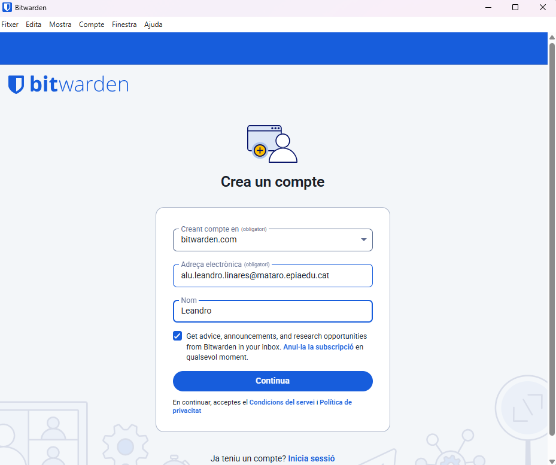
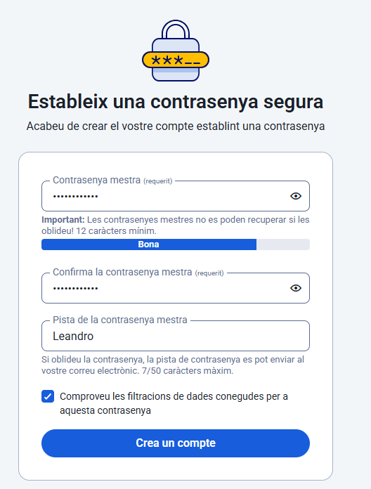
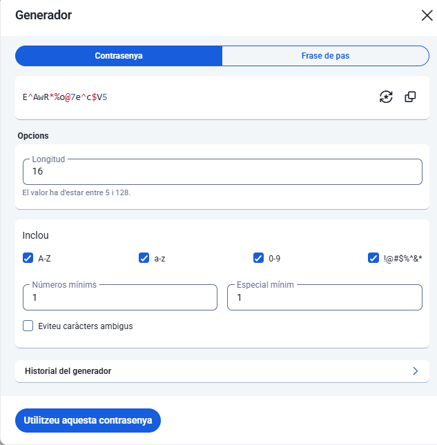

# **🧰 Guia d’Ús Tècnica – Bitwarden**

**Fase 2 – Projecte 3: Gestió Segura de Contrasenyes**

## **1️⃣ Instal·lació i Configuració Inicial**

### **1.1 Descàrrega de l’aplicació**

1. Accediu al lloc web oficial de Bitwarden:  
    👉 [https://bitwarden.com/download](https://bitwarden.com/download)

2. Seleccioneu la versió corresponent al vostre sistema operatiu (Windows, macOS o Linux).

3. Descarregueu el fitxer d’instal·lació i executeu-lo.

4. Seguiu les instruccions de l’assistent fins a completar la instal·lació.

### **1.2 Creació del compte mestre**

1. Un cop instal·lat, obriu Bitwarden i feu clic a **“Create Account”**.

2. Introduïu:

   * Correu electrònic corporatiu o personal.

   * Contrasenya mestra **robusta** (mínim 12 caràcters, amb majúscules, minúscules, números i símbols).

3. Deseu el vostre compte.

4. Bitwarden crearà automàticament la vostra **BBDD principal (Vault)**, on es desaran totes les contrasenyes.
   
   

   

💡 *Consell:* Apunteu la vostra contrasenya mestra en un lloc físic segur. Sense aquesta, no podreu recuperar l’accés al vostre Vault.

## **2️⃣ Generació de Contrasenyes Segures**

### **2.1 Accés al generador de contrasenyes**

1. A la interfície principal, feu clic a la icona **“Generator”** o aneu al menú lateral esquerre i seleccioneu **“Password Generator”**.

2. Configureu els paràmetres segons les vostres necessitats:

   * **Longitud:** recomanat mínim 16 caràcters.

   * **Incloure majúscules i minúscules.**

   * **Afegir números i caràcters especials.**

3. Feu clic a **“Generate”** per obtenir una nova contrasenya.

4. Copieu-la o deseu-la directament a una nova entrada del vostre Vault.

 

💡 *Recomanació:* Activeu sempre l’opció de caràcters especials i augmenteu la longitud per millorar la seguretat.

## **3️⃣ Exemples d’Ús i Emplenament Automàtic**

### **3.1 Desar una credencial d’un compte de correu electrònic**

1. Al tauler principal, feu clic a **“Add Item” → “Login”**.

2. Ompliu els camps:

   * **Nom:** Gmail (o el servei que correspongui)

   * **Usuari:** exemple@gmail.com

   * **Contrasenya:** utilitzeu el generador de contrasenyes per crear-ne una segura.

3. Feu clic a **Save**.

 

### **3.2 Desar una credencial d’una aplicació o servei web**

1. Feu el mateix procés que abans, però introduïu l’URL del servei, per exemple:  
    `https://github.com`

2. Ompliu usuari i contrasenya.

3. Deseu la credencial.
 

 

### **3.3 Ús de l’extensió del navegador**

1. Aneu a la **Chrome Web Store** o **Firefox Add-ons** i cerqueu “Bitwarden”.

2. Instal·leu l’extensió del navegador.

3. Inicieu sessió amb el vostre compte mestre.

4. Quan accediu a una pàgina d’inici de sessió (p. ex. Gmail o GitHub), l’extensió detectarà automàticament el lloc i mostrarà les credencials desades.

5. Feu clic sobre la credencial per **emplenar automàticament** el formulari.

📸  
 ``

💡 *Nota:* L’emplenament automàtic redueix errors humans i evita la reutilització de contrasenyes.

## **4️⃣ Gestió de Còpies de Seguretat (Backup)**

### **4.1 Exportar la base de dades**

1. A l’aplicació d’escriptori o web, accediu a **Settings → Tools → Export Vault**.

2. Trieu el format de fitxer:

   * `.json` (text pla) o

   * `.csv` (full de càlcul)

3. Introduïu la vostra contrasenya mestra per confirmar.

4. Deseu el fitxer en una ubicació temporal segura.

📸  
 ``

⚠️ *Atenció:* L’arxiu exportat **no està xifrat**. No el guardeu mai permanentment en un disc no segur.

### **4.2 Bones pràctiques per emmagatzemar el backup**

* Desa la còpia en una **clau USB xifrada** o disc dur extern protegit amb contrasenya.

* Alternativament, puja-la a un **servei de núvol amb xifratge de punta a punta** (com Tresorit o Proton Drive).

* Mantingues sempre una **única còpia actualitzada** i elimina versions antigues.

* No comparteixis mai el fitxer exportat per correu o missatgeria sense xifrar-lo abans (p. ex. amb VeraCrypt o 7-Zip amb contrasenya forta).

📸  
 ``

## **✅ Conclusions**

Aquesta guia permet a l’equip tècnic:

* Instal·lar i configurar Bitwarden correctament.

* Generar contrasenyes segures i úniques.

* Desar i gestionar credencials de manera centralitzada.

* Utilitzar l’emplenament automàtic per millorar la productivitat.

* Fer còpies de seguretat de forma segura, evitant la pèrdua o exposició de dades.

Amb aquestes pràctiques, l’organització garanteix una **gestió segura i eficient de totes les contrasenyes corporatives**.

