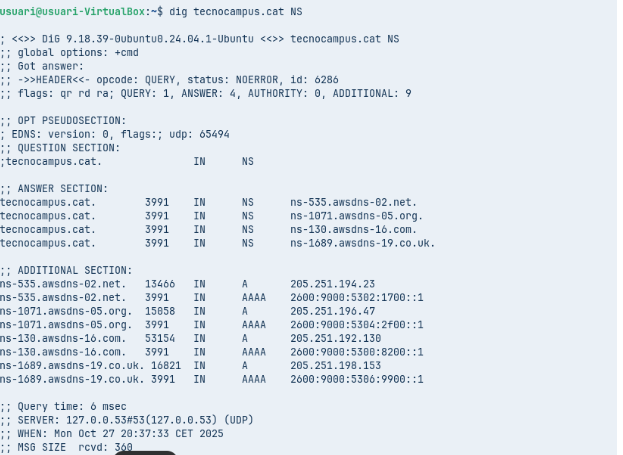
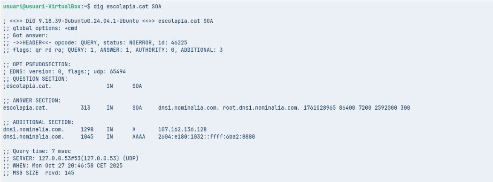
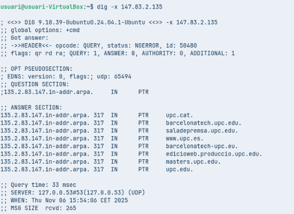
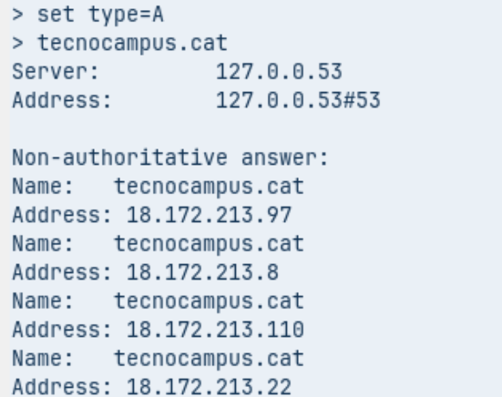
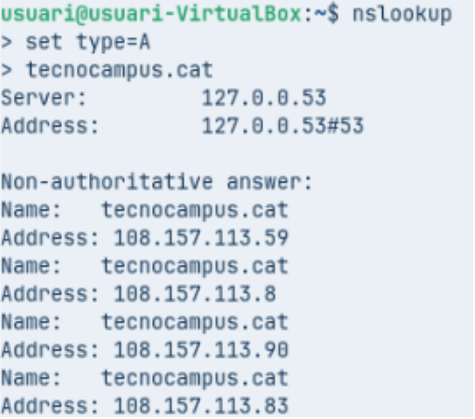
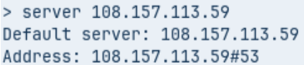
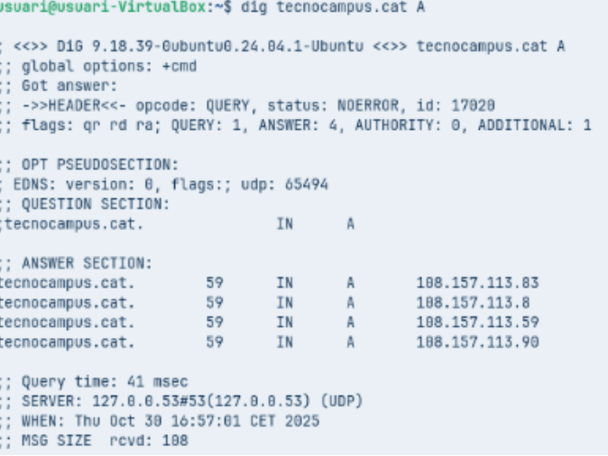

# 🧩 T06 Fase Pràctica: Diagnosi de Noms (Auditoria amb CLI)

## 🌐 Informació general

- **IP de resposta:** `83.247.151.214`  
- **Valor TTL:** `1442`  
- **Servidor que ha respost:** `127.0.0.53`

---

## 🧭 Servidors de noms (DNS)

- `ns-535.awsdns-02.net.`  
- `ns-1071.awsdns-05.org.`  
- `ns-130.awsdns-16.com.`  
- `ns-1689.awsdns-19.co.uk.`

---

## 📧 Informació del correu de l'administrador

- **Contacte:** `root.dns1.nominalia.com.` → `root@dns1.nominalia.com`  
- **Número de sèrie:** `1761028965`

---

## 🏫 Informació de la xarxa

La IP `147.83.2.135` pertany a la **xarxa de la Universitat Politècnica de Catalunya (UPC)** i està vinculada a diversos noms de domini institucionals mitjançant **registres PTR**.

---

## ⚙️ Tipus de resposta

La resposta és **no autoritativa**, ja que el servidor que ha contestat (`127.0.0.53`) **no és el que gestiona directament** el domini `tecnocampus.cat`.

---

## 📝 Conclusió

Aquesta auditoria mostra la informació principal de resolució de noms per al domini `tecnocampus.cat`, incloent:
- Respostes DNS no autoritatives.
- Identificació dels servidors de noms oficials.
- Dades del registre SOA i del correu de l’administrador.
- Relació de la IP `147.83.2.135` amb la UPC.

---

✍️ **Autor:** _Nom de l’estudiant_  
📅 **Data:** _DD/MM/AAAA_
  
